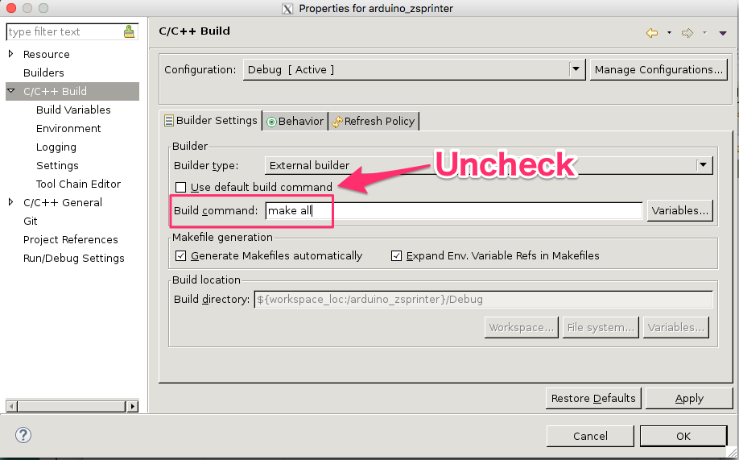

# Zsprinter-pynquino

## What is this
A 3D printer firmware which runs on PYNQ-Z1. Codes are derived from the Sprinter by kliment. https://github.com/kliment/sprinter

## How to build with CLI (under the PYNQ/pynq/lib/arduino folder)
1. Prepare Pynquino BSP using the instruction here.
https://github.com/shohei/pynquino-bsp-library

2. Clone this repository
```
cd pynq/pynq/lib/arduino
git clone https://github.com/shohei/zsprinter-pynquino
mv zsprinter-pynquino/arduino_zsprinter .
cp -r ../../../boards/sw_repo/bsp_iop_arduino_mb bsp_iop_arduino
(If your hardware design is the same as mine, do the following: 
mv zsprinter-pynquino/bsp_iop_arduino .)
cd arduino_zsprinter/Debug
make
```

##  How to build with GUI (Xilinx SDK)
1. Clone this library to SDK folder
```
cd pynq/pynq/boards/Pynq-Z1/base/base/base.sdk
git clone https://github.com/shohei/zsprinter-pynquino
mv zsprinter-pynquino/arduino_zsprinter .
mv zsprinter-pynquino/bsp_iop_arduino .
```
2. Import BSP and Zsprinter project into Xilinx SDK

3. Change C/C++ build setting
Not sure why, but Xilinx SDK executes "make clean" all the time, rather than "make all".
We have to update the defalt make behavior as shown in the picture below.



